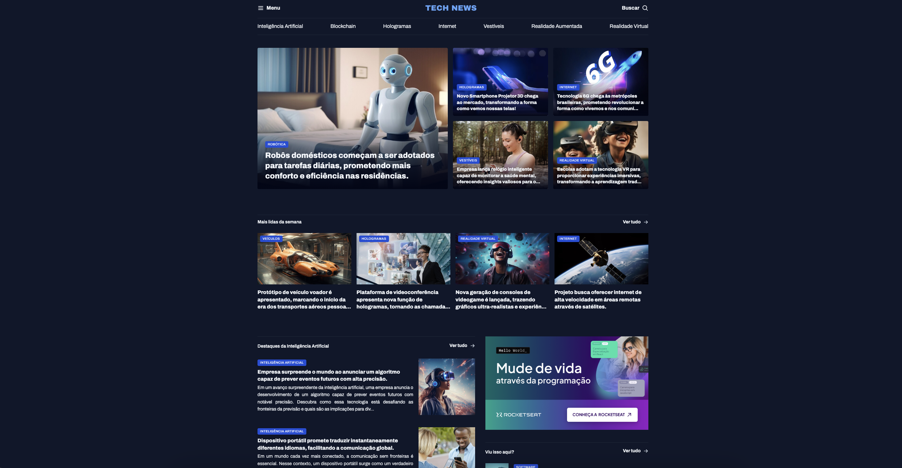

Página Web sobre Tecnologia 🌐

Exemplo da página inicial do projeto:

✨ Sobre o Projeto
Este é um projeto de página web interativa e estilizada, inspirada no design do Figma, abordando temas como Inteligência Artificial, Internet e Tecnologia no Geral. A ideia central foi criar uma interface moderna e responsiva para apresentar tópicos relevantes do mundo tecnológico.

🛠️ Tecnologias Utilizadas
HTML5: Estrutura da página.
CSS3: Estilo e design responsivo.
Figma: Inspiração para o design.
🌟 Funcionalidades
Layout responsivo para dispositivos móveis e desktops.
Design interativo e moderno, inspirado em tendências visuais.
Conteúdo categorizado por tópicos como IA, Internet e outros aspectos tecnológicos.

🚀 Como Executar o Projeto

Clone o repositório:

git clone https://github.com/seu-usuario/seu-repositorio.git

Navegue até a pasta do projeto:

cd Portal-de-noticias
Abra o arquivo index.html em seu navegador preferido.

📂 Estrutura de Arquivos

/
├── css/
│   └── style.css        # Estilos da página
├── img/
│   └── exemplo.jpg      # Imagens utilizadas
├── js/
│   └── script.js        # Scripts da página (opcional)
├── index.html           # Arquivo principal
└── README.md            # Documentação do projeto
📸 Screenshots
Adicione aqui capturas de tela do projeto para mostrar os diferentes tópicos e a interatividade da página.

🎯 Melhorias Futuras
Implementar novos tópicos sobre tecnologia.
Adicionar animações e interações com JavaScript.
Tornar a página multilíngue (ex: inglês e português).
